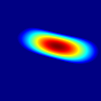
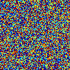

# ddpm-sr-for-TFM

本项目实现了基于扩散模型的透射场无损检测超分辨率（TFM SR）流程，涵盖数据生成、条件扩散网络训练与评估脚本，全部模块均在仓库内实现。

<div align="center">
  <table>
    <tr>
      <td align="center"><br>t = 1000：纯噪声</td>
      <td align="center"><br>TFM 指导扩散</td>
      <td align="center"><br>扩散结果：缺陷形貌</td>
    </tr>
  </table>
  <p>TFM 观测提供条件引导，噪声通过少量扩散迭代逐步收敛到真实缺陷形貌。</p>
  
</div>

---

## 文档索引

- 项目架构：[docs/architecture.md](docs/architecture.md)
- 数据准备：[docs/data_preparation.md](docs/data_preparation.md)
- 训练指南：[docs/training_guide.md](docs/training_guide.md)
- 评估流程：[docs/evaluation_guide.md](docs/evaluation_guide.md)
- 配置说明：[docs/configuration.md](docs/configuration.md)
- API 速查：[docs/api_reference.md](docs/api_reference.md)
- 实验记录：[docs/experiments.md](docs/experiments.md)
- 常见问题：[docs/faq.md](docs/faq.md)
- 教程 Notebook：[docs/tutorials](docs/tutorials)

---

## 数据集采集

- 默认数据由 k-Wave 仿真生成，可参考开源脚本：<https://github.com/cacdcaecawae/data-for-TFM-kwave>。
- 仿真后将低分辨率观测（`TFM/样本号`）与高分辨率真值（`hr/样本号`）整理为 HDF5，即可被 `dataset.H5PairedDataset` 自动加载。
- HDF5 目录结构、归一化及增强策略详见 [数据准备说明](docs/data_preparation.md)，也可结合 [项目架构](docs/architecture.md) 了解数据如何贯穿网络。

## 训练流程

1. **环境准备**  
   Python 3.10+，PyTorch ≥ 2.1（建议 GPU 版本），常用依赖包括 `torchmetrics`、`opencv-python`、`tensorboard`、`einops`、`tqdm` 等。  
   ```bash
   pip install torch torchvision torchmetrics opencv-python tensorboard einops tqdm
   ```
2. **配置编辑**  
   复制并修改 `configs/sr_train.json`，设置数据路径、骨干网络（`convnet_*` / `unet_*`）、优化器与日志参数。完整字段说明见 [配置文件详解](docs/configuration.md)。
3. **启动训练**  
   ```bash
   python SR_train.py --config configs/sr_train.json
   ```
   - 训练脚本会构建 `H5PairedDataset`、初始化扩散模型，并结合余弦调度与 EMA 更新权重。
   - 日志写入 `runs/`，可通过 `tensorboard --logdir runs` 查看；若开启 `logging.save_preview_images`，会在 `SR/previews/` 导出采样图。
4. 更多调参建议（AMP、EMA、数据增强等）可参考 [训练指南](docs/training_guide.md) 与教程 `docs/tutorials/quickstart.ipynb`。

## 评估流程

1. **准备配置**  
   复制 `configs/eval.json`，填入评估集路径、模型 checkpoint、采样器（DDPM / DDIM）及阈值参数。
2. **执行评估**  
   ```bash
   python eval.py --config configs/eval.json
   ```
   - `eval.py` 会按配置加载模型，调用 `sample_backward_sr` 生成超分结果，并计算 PSNR / SSIM。
   - 输出目录（`output.root`）默认包含预测图像、`results.txt` 与 `results_per_image.csv`。
3. 采样步数、随机性（`eta`）、阈值裁剪、可选 VAE 等说明详见 [评估指南](docs/evaluation_guide.md) 与 [API 速查](docs/api_reference.md)。

## 其他说明

- 如未搭建 Python 环境，建议使用 “VS Code + Anaconda” 组合，可参考入门视频：[py 虚拟环境搭建](https://www.bilibili.com/video/BV1bQ4y1n7sn/?spm_id_from=333.1387.favlist.content.click&vd_source=fa7df163675956e625633678e8c906fa)。
- 推荐配合 DeepWiki 学习扩散/反演相关知识：  
  - DeepWiki 主页：<https://deepwiki.org/>（可直接粘贴仓库地址，例如 `https://github.com/cacdcaecawae/ddpm-for-srtfm/tree/hdf5`）。  
  - DeepWiki 使用介绍：<https://zhuanlan.zhihu.com/p/1900126204851381576>。
- 提交前建议执行 `pytest`（位于 `tests/`），并将实验配置、指标记录在 [docs/experiments.md](docs/experiments.md)；常见问题可参考 [docs/faq.md](docs/faq.md)。
- 教程 Notebook：  
  - [docs/tutorials/quickstart.ipynb](docs/tutorials/quickstart.ipynb)：验证环境、读取配置并生成训练/评估命令。  
  - [docs/tutorials/advanced_training.ipynb](docs/tutorials/advanced_training.ipynb)：分块讲解 `SR_train.py`，配合示例代码剖析训练流程。  
  - [docs/tutorials/visualization.ipynb](docs/tutorials/visualization.ipynb)：调用工具脚本生成扩散 GIF，展示噪声收敛过程。  
